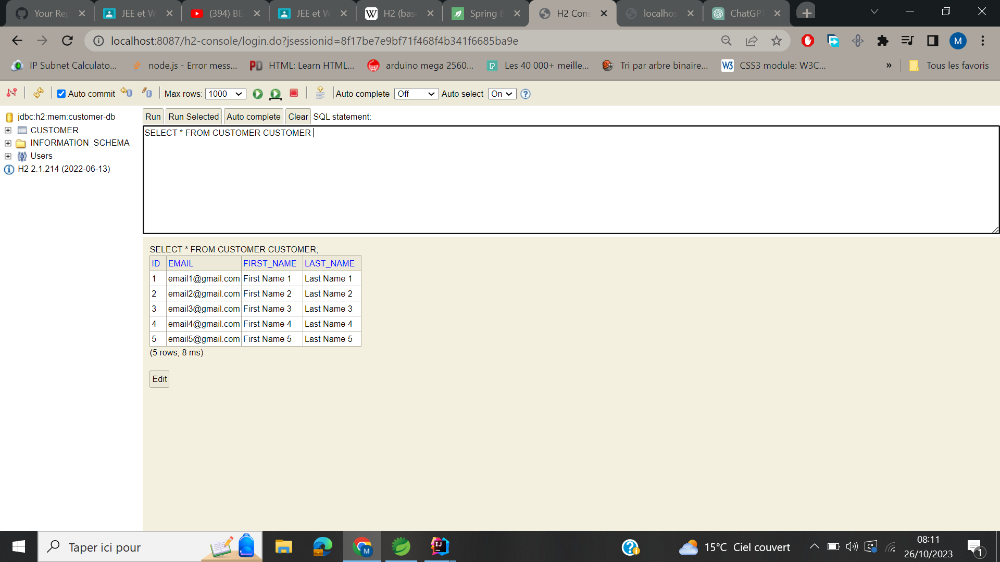
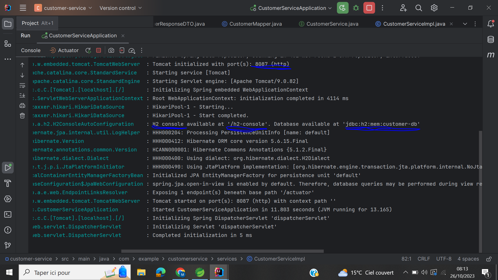
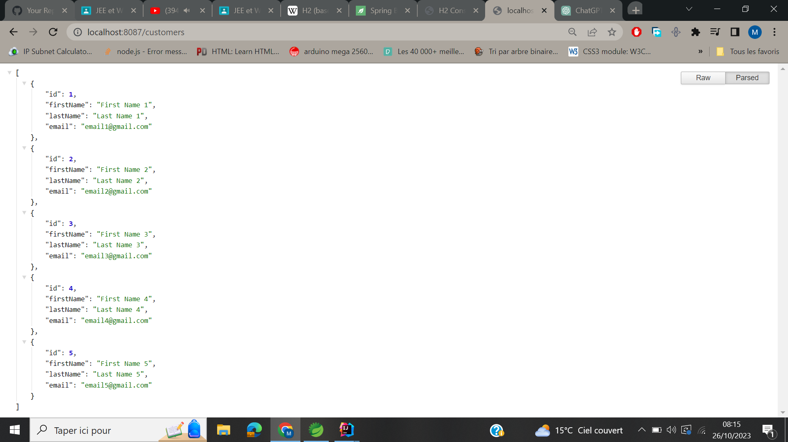
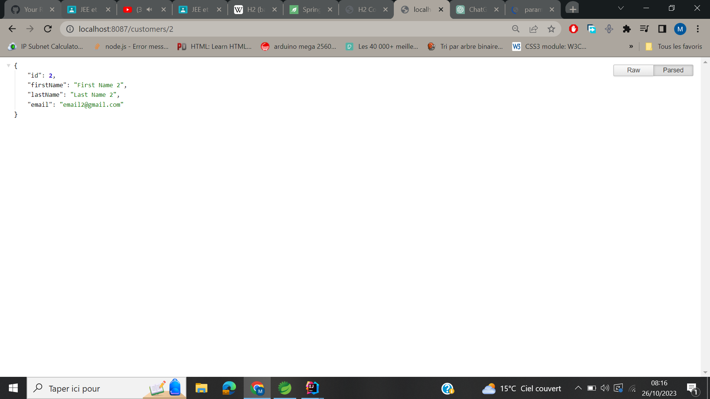
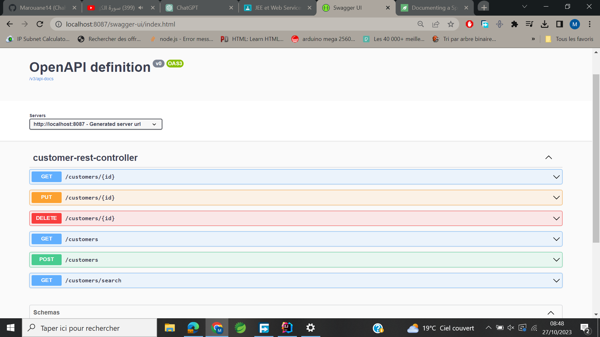
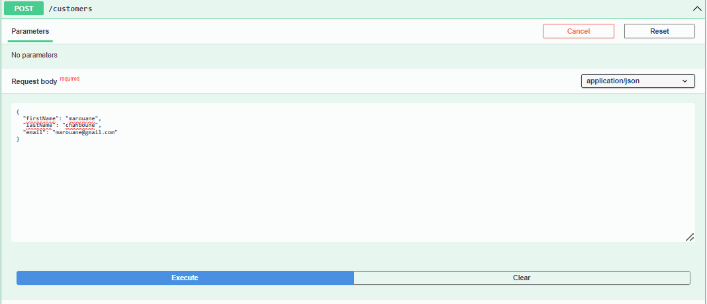
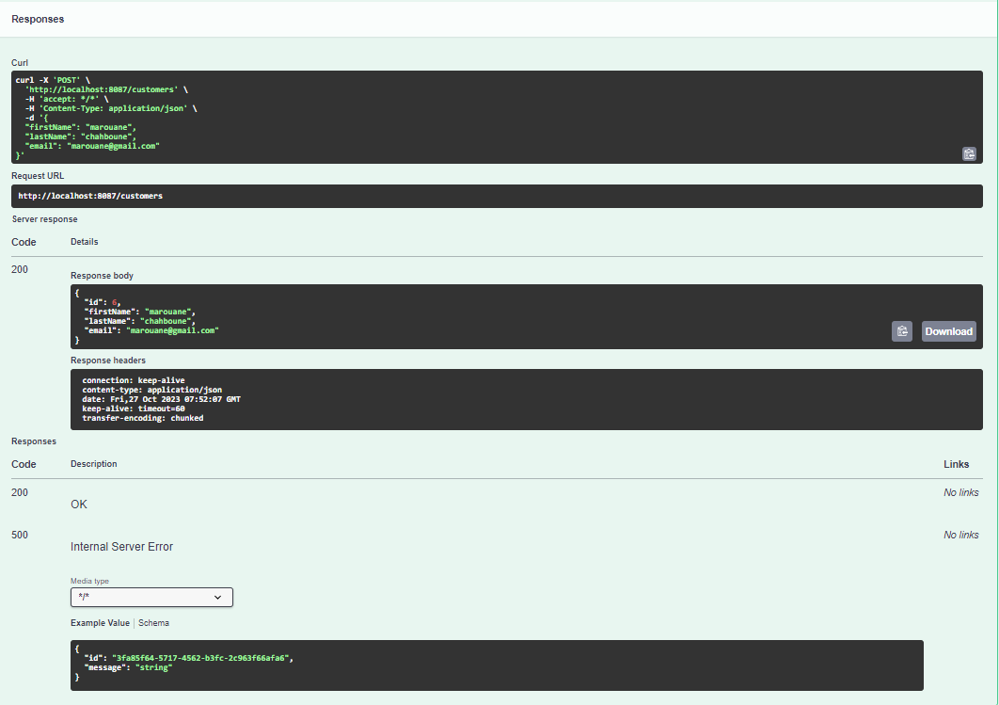

<h1>Customer Microservice</h1>
<h3>Requete Select pour les customers</h3>

<h3>Démarrage de notre microservice</h3>

<h3>Test de la méthode GET pour récuperer la liste des "customers"</h3>

<h3>Test de la méthode GET pour récuperer le "customer" par "id"</h3>

<h3>L'utilisation de "OpenAPI"</h3>

<h3>Test de la méthode POST pour ajouter un customer</h3>
<h4>Requête</h4>

<h4>Réponse</h4>
